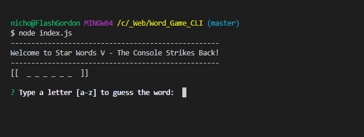
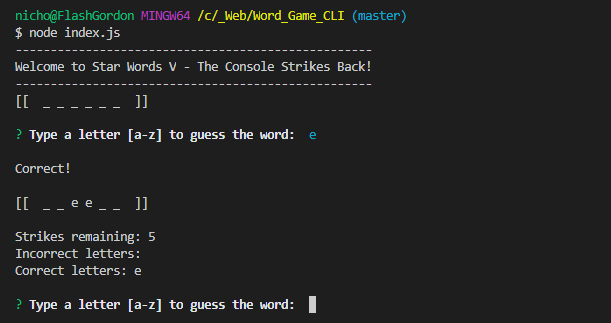
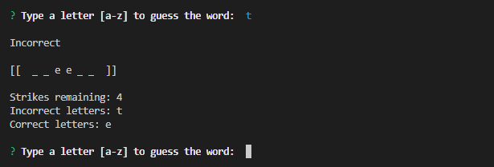
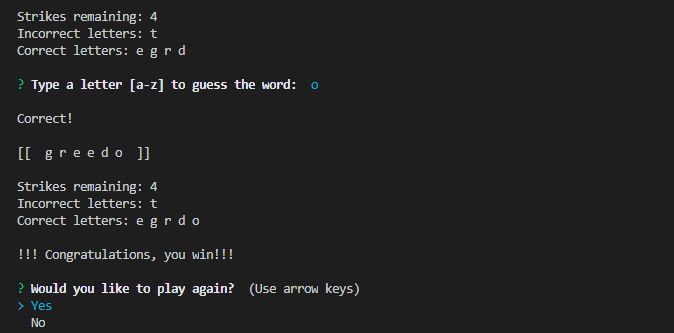
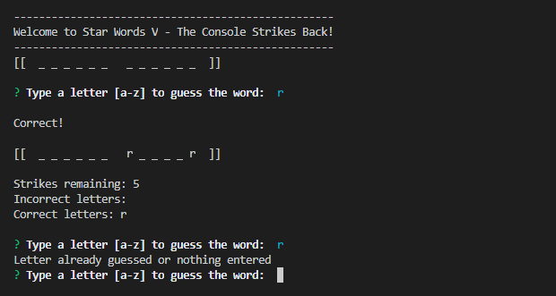
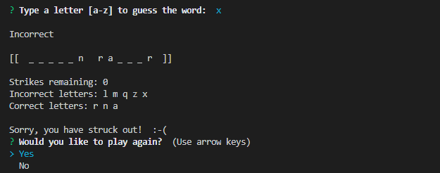
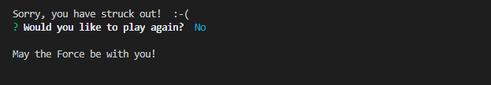

# Word_Game_CLI - Word Guess Game using JavaScript Constructors

### Overview

A Word Guess command-line game using constructor functions.

The completed game does the following:

1. It receives user input using the `inquirer` npm package.

2. It is broken up into three files:

* **Letter.js**: Contains a constructor, Letter. This constructor displays an underlying character or a blank placeholder (such as an underscore), depending on whether or not the user has guessed the letter. The constructor is  defined as follows:

  * A string value to store the underlying character for the letter

  * A boolean value that stores whether that letter has been guessed yet

  * A function that returns the underlying character if the letter has been guessed, or a placeholder (like an underscore) if the letter has not been guessed

  * A function that takes a character as an argument and checks it against the underlying character, updating the stored boolean value to true if it was guessed correctly

```js
function Letter(actualLetter) {
    this.theLetter = actualLetter;
    this.foundLetter = false;

    this.toString = function () {
        if (this.theLetter === " ") {
            this.foundLetter = true;
            return " ";
        } else {
            if (this.foundLetter === false) {
                return "_";
            } else {
                return this.theLetter;
            }
        }
    };
    this.checkLetter = function (thePassedLetter) {
        if (thePassedLetter === this.theLetter) {
            this.foundLetter = true;
        } 
    }
}
```

* **Word.js**: Contains a constructor, Word that depends on the Letter constructor. This is used to create an object representing the current word the user is attempting to guess. That means the constructor defines:

  * An array of `new` Letter objects representing the letters of the underlying word

  * A function that returns a string representing the word. This should call the function on each letter object (the first function defined in `Letter.js`) that displays the character or an underscore and concatenate those together.

  * A function that takes a character as an argument and calls the guess function on each letter object (the second function defined in `Letter.js`)

```js
var Letter = require("./letter.js")
// When you call Word and pass it a word, it breaks the word up into characters.
// Each character is used to create an object using the Letter constructor.
// Then each object is put into the wordArray.

function Word(aWord) {
    this.wordArray = [];

    //var output = aWord.split('')  <-- we don't need this

    //console.log("You passed: " + aWord)
    for (var i = 0; i < aWord.length; i++) {
        //console.log(output[i])
        var x = new Letter(aWord[i])  // This makes a new object using the Letter constructor. Name of each object is each letter of the word.
        this.wordArray.push(x)        // Put the object into an array (wordArray).
        //console.log("x is: " + x)
    }
    // if the word is "han solo", then wordArray will be: _ _ _  _ _ _ _
    // or more correctly: "___ ____"
    //console.log("-----------------------")
    //for (var i = 0; i < this.wordArray.length; i++) {
       // console.log("word Array[" + i + "] --> " + this.wordArray[i].theLetter)
    //}

    // Create a string (s) using every object in the wordArray (which is really an array of characters).
    // If the word was "han solo" then the array would be "___ ____"
    // Notice the lack of spaces between the letters.
    // To fix this, we add spaces using the next function:
    this.stringTheWord = function() {
        var s = "";
        for (var i = 0; i < this.wordArray.length; i++) {
            s += this.wordArray[i] + " ";
            
        }
        console.log("[[  " + s + " ]]\n")
    }

    this.userGuess = function(aLetter) {
        for (var i = 0; i < this.wordArray.length; i++) {
            this.wordArray[i].checkLetter(aLetter)
        }
    }
}

//Word("Deathstar");
//var xx = new Word("Luke Skywalker")

//console.log(xx.s + "\n");
//xx.stringTheWord();

//xx.userGuess("a");
//xx.stringTheWord();

//console.log("-->" + xx.s + "\n");

//var s = xx.stringTheWord
//console.log("this is a string of 'Deathstar': " + s)


module.exports = Word;

```


* **index.js**: The file containing the logic for the course of the game, which depends on `Word.js` and:

  * Randomly selects a word and uses the `Word` constructor to store it

  * Prompts the user for each guess and keeps track of the user's remaining guesses

```js
// too much to list... see index.js
```

3. `Word.js` requires `Letter.js`

4. `index.js` requires `Word.js` and `inquirer`

Screenshots of the application in action:

Start:



Correct letter:



Incorrect letter:



You win:



Duplicate letter guessed: 



You lose:



Quit game:



